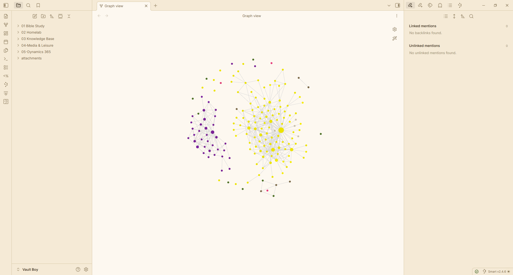

# 🐾 Clawdia

**An ancient cat watches over your vault.**

Clawdia is a warm, gothic-inspired theme for [Obsidian](https://obsidian.md), built around a creamy ink palette with ember-glow amber accents. Designed to feel like reading by candlelight in an old library — with a cat watching from the shadows.

## ✨ Features

- **Dual themes** — Full dark and light modes, each carefully color-balanced
- **Gothic warmth palette** — Deep ink backgrounds, cream text, ember-orange accents
- **Serif body typography** — Georgia/Palatino for reading, Inter/system fonts for UI
- **Custom code syntax** — Full syntax highlighting in both themes
- **Styled callouts** — All callout types themed with Clawdia's palette
- **Graph view** — Custom node colors for focused, unresolved, and tagged notes
- **Canvas support** — Themed canvas background, dots, and card borders
- **Polished details** — Custom blockquotes, tables, checkboxes, tags, highlights, modals, command palette, and more
- **Paw print watermark** — A subtle cat signature on empty workspace panes
- **Slim scrollbars** — Unobtrusive 6px scrollbars with themed hover states
- **[Style Settings](https://github.com/mgmeyers/obsidian-style-settings) support** — Customize accent color and font size, or hide the watermark/heading ornament, without editing CSS
- **Mobile support** — Themed navbar and drawer for the Obsidian mobile app
- **AA-contrast text** — Body and accent text checked against WCAG AA contrast ratios in both themes

## 📦 Installation

### From Obsidian Community Directory

1. Open **Settings → Appearance**
2. Under **Themes**, click **Manage**
3. Search for **Clawdia**
4. Click **Install**

### Manual Installation

1. Download `manifest.json` and `theme.css` from the [latest release](https://github.com/TheShield2594/clawdia-obsidian-theme/releases)
2. Create a folder named `Clawdia` in your vault's `.obsidian/themes/` directory
3. Place both files in that folder
4. Open **Settings → Appearance → Themes** and select **Clawdia**

## 🎨 Color Palette

> **Note:** All shades below `claw-500` are derived at runtime via `color-mix()` from the accent color. The values shown here are the computed result when using the default `#d97742` accent. Changing the accent in Style Settings recalculates all shades automatically.

| Role | Dark | Light |
|------|------|-------|
| Background | `#14110d` (ink-950) | `#faf6ef` (cream-50) |
| Text | `#f3ecdd` (cream-100) | `#14110d` (ink-950) |
| Accent | `#d97742` (claw-500) | `#d97742` (claw-500) |
| Headings | `#e8ac8c` (claw-300) | `#98532e` (claw-700) |
| Links | `#e08f64` (claw-400) | `#98532e` (claw-700) |
| Unresolved links | `#7e5570` (plum-500) | `#7e5570` (plum-500) |
| External links | `#8a9863` (moss-400) | `#6a7a44` (moss-500) |

### Full Accent Scale

| Shade | Hex | Derivation |
|-------|-----|------------|
| claw-700 | `#98532e` | 70% claw + 30% black |
| claw-600 | `#bb6639` | 86% claw + 14% black |
| claw-500 | `#d97742` | Base accent (user-configurable) |
| claw-400 | `#e08f64` | 82% claw + 18% white |
| claw-300 | `#e8ac8c` | 61% claw + 39% white |
| claw-100 | `#f4d6c6` | 30% claw + 70% white |

## 🔤 Fonts

Clawdia uses the following font stack. Fonts that aren't installed will gracefully fall back to system defaults.

| Usage | Font | Fallback |
|-------|------|----------|
| Body / Reading | Georgia | Palatino, serif |
| Interface | Inter Tight | Inter, Segoe UI, system-ui, sans-serif |
| Code | JetBrains Mono | Fira Code, Cascadia Code, monospace |

For the best experience, install [Inter](https://rsms.me/inter/) and [JetBrains Mono](https://www.jetbrains.com/lp/mono/) — both are free.

## 🎛️ Customizing

Install the [Style Settings](https://github.com/mgmeyers/obsidian-style-settings) community plugin to customize Clawdia without editing CSS:

- **Accent Color** — change the ember-orange accent used for links, buttons, and highlights
- **Body Font Size** — adjust reading text size from 14–20px
- **Hide Paw Watermark** — turn off the cat signature on empty panes
- **Hide Heading Ornament** — turn off the ✦ before H1 headings

## 📋 Requirements

- Obsidian **1.5.0** or later

## 📄 License

[MIT](LICENSE) © [TheShield2594](https://github.com/TheShield2594)

## 🐛 Issues & Feedback

Found a bug or have a suggestion? [Open an issue](https://github.com/TheShield2594/clawdia-obsidian-theme/issues/new).

## ☕ Credits

Clawdia is inspired by the [Clawdia bot](https://github.com/TheShield2594) — an ancient cat with gothic warmth.
